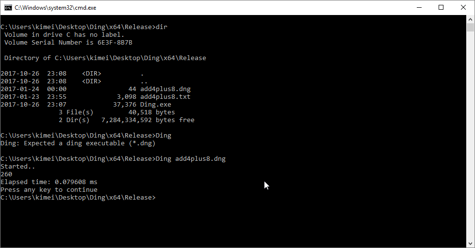
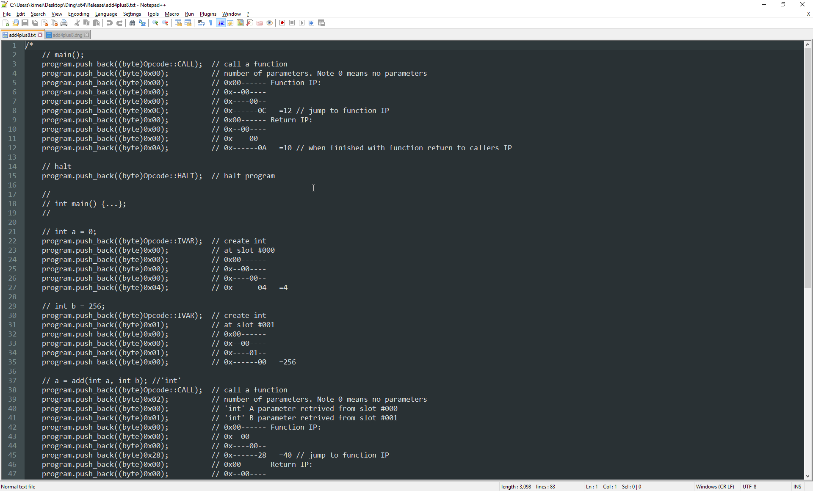
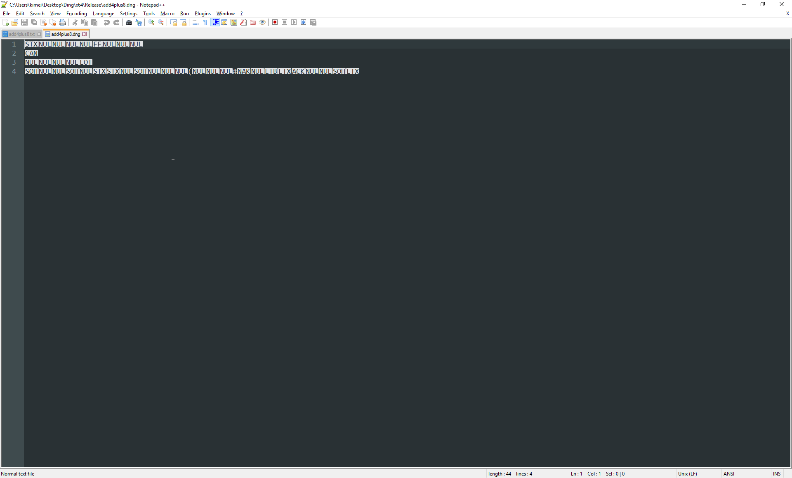
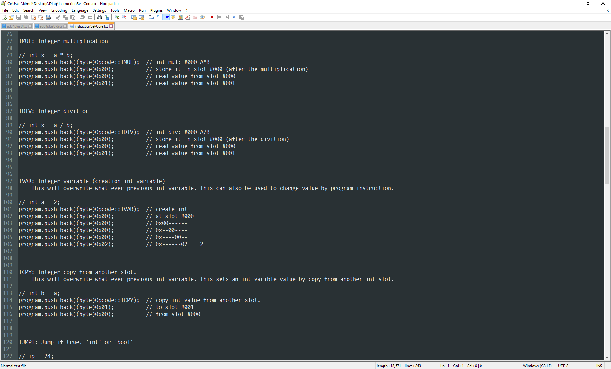

# Ding

A virtual machine (VM) that simulates a virtual CPU with a custom instruction set. This CPU can load a program compiled as bytecode. The sample Ding program is placing value 4 into register slot 0, and then placing 256 into register slot 1. Then it call the add-function which adds register 0 and register 1, then place the result in register 0. And finally we print the value 260 to the screen. If you want you could make your own Ding program by using the instruct-set. You need to create the binary by hand since there are no compilers yet made.

Tags: C++, VM, Bytecode, CPU
